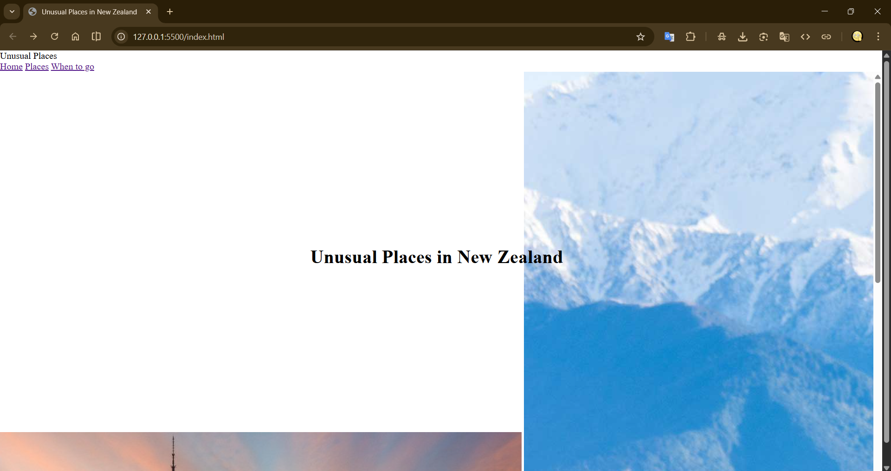

Unusual Places in New Zealand
About this project

This website was created as an English school project by an 11th grade student.

The main goal of this project is to present 10 unusual and beautiful places in New Zealand.
I wanted to make something more interesting than just a regular presentation, so I decided to create a simple website where users can explore places and read short descriptions.

The project includes:

a home section

a places section with cards

smooth scrolling

basic responsive design for mobile devices

This is a school project, so some small mistakes or bugs may still exist.

🎯 Project Goal

Improve English writing skills

Learn how to structure information clearly

Present information in a modern and creative way

🛠 Development Process

Here are some screenshots from the process of creating this website:

🖥 First layout version

🎨 Styling and structure

📱 Testing responsiveness

🔗 Live Website

You can view the project here:
👉 https://astrlime.github.io/unusual-places-newzealand/
